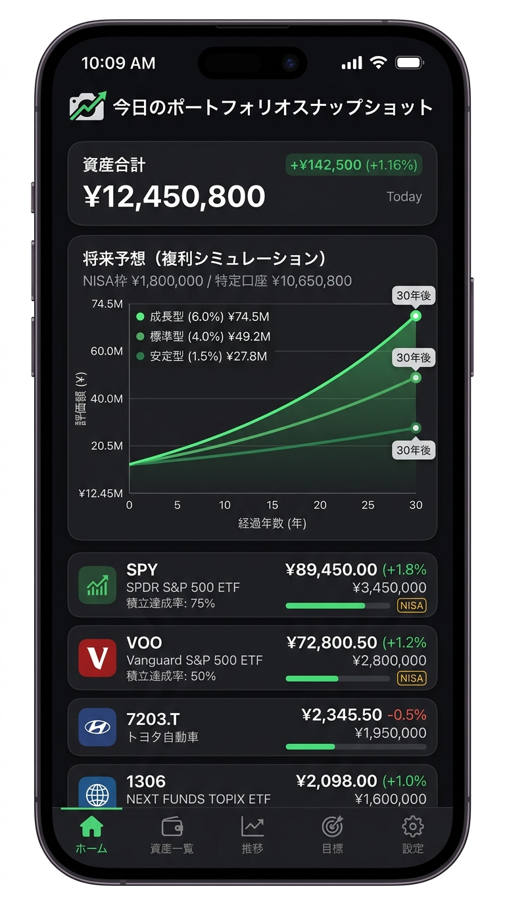
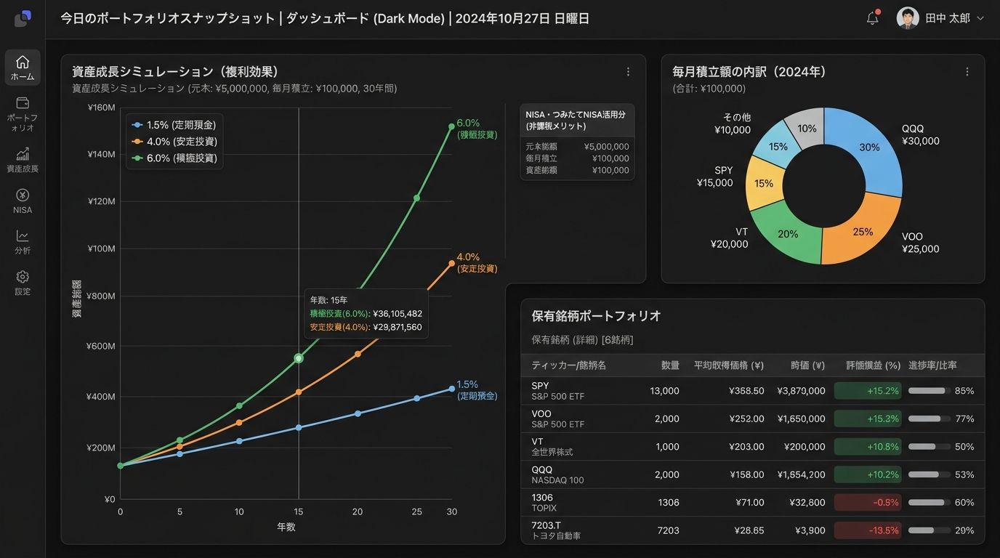

# 今日のポートフォリオスナップショット (Daily Portfolio Snapshot)

> **アカウント不要でローカル保存。NISA対応の月額積立と将来予想を簡単に管理**
> Twelve Data の前日終値を取得し、前日比、月額積立（概算買付口数）、NISA非課税枠管理、複利シミュレーション（SVGマルチシナリオグラフ）をブラウザ単体で完結提供するモバイルファーストSPAです。

---

## 📸 UIモック画像

| モバイル表示 (375 × 812) | デスクトップ表示 (1280 × 720) |
| :---: | :---: |
|  |  |

---

## 🌟 主な機能・仕様

### 1. 保有資産の登録UI & テーブル一括登録
- 個別登録フォーム: シンボル、保有数量（任意）、月額積立（円のみ入力、口数は自動計算）、取得価格（任意）、積立開始年月（任意）、メモ（任意）、NISA/課税フラグ。
- 一括テーブル入力: 複数銘柄をスプレッドシート感覚でまとめて登録・編集可能。

### 2. 月額積立設定（NISA対応・金額指定のみ）
- 月額は円で入力するだけ。口数（買付数量）は現在価格と為替レートから自動計算（概算）。
- 推定買付口数 = 月額（円） ÷ 現在価格（円換算）
- 積立開始年月、NISAフラグを設定可能。

### 3. 個別株・国内ETF対応
- 国内株・東証ETFは末尾に .T（例: 7203.T, 1306）を付けて入力可能。

### 4. 将来予想（複利シミュレーション & SVGグラフ）
- 5/10/15/20/30年の期間を選択。
- 3シナリオ: 保守 1.5% / 標準 4.0% / 楽観 6.0%
- NISA口座（非課税）と課税口座（20.315%税引後）を分離試算。

---

## ⚠️ 重要な注意事項

### 免責
本アプリの評価額・推定口数・シミュレーション結果は概算値であり、投資収益を保証しません。
為替手数料、信託報酬、税制改正、年間投資枠制限は加味されていません。

### APIキーのリスク
- Twelve Data APIキーはブラウザの LocalStorage にのみ保存されます。
- 商用運用時は Cloudflare Workers / Vercel Serverless Function でAPIキーを環境変数に秘匿してください。

### Twelve Data のレート制限
- 無料枠: 8リクエスト/分・800回/日
- 本アプリは24時間キャッシュで最小限のリクエストのみ送信します。

---

## 🚀 導入手順

### 方法1: 単一ファイル版（最速）
index.html をブラウザでダブルクリックするだけで即座に動作します（ビルド不要）。
file:// プロトコルでも LocalStorage は正常に動作します。

注意: PWAとしてホーム画面に追加する機能は http:// または https:// でのみ動作します。

---

### 方法2: ローカルサーバーで起動（PWA & スマホ対応）

Node.js / npx (推奨):
`
cd daily-portfolio-snapshot
npx serve .
npx serve . -p 8080
`

Python 3:
`
cd daily-portfolio-snapshot
python -m http.server 8000
`

---

### 方法3: React + Vite 雛形
`
cd framework-template
npm install
npm run dev
`

---

## 📱 スマホでの開き方

### 同一Wi-Fiネットワーク経由でスマホから開く
1. PCでローカルサーバーを起動します（方法2参照）。
2. PCのローカルIPアドレスを確認:
   - Windows: ipconfig → IPv4 アドレスの値（例: 192.168.1.10）
   - Mac/Linux: ifconfig | grep inet
3. スマホのブラウザで http://192.168.1.10:8000 を開きます。
   ※ PCとスマホが同じWi-Fiに接続されていることを確認。

### PWAとしてホーム画面に追加
- iOS (Safari): 「共有」→「ホーム画面に追加」
- Android (Chrome): メニュー →「アプリをインストール」

---

## ☁️ OneDrive共有・クラウドストレージ上での注意

OneDrive / Google Drive / Dropbox などのフォルダ内から file:// で直接開く場合:

| 問題 | 原因 | 対策 |
|------|------|------|
| LocalStorageのデータが消える | クラウド同期によるキャッシュ競合 | ローカルフォルダにコピーして使用 |
| ファイルが開けない（ロック中） | クラウドが同期中にファイルをロック | 同期完了後に開く |
| Service Worker が動作しない | file:// プロトコルの制限 | npx serve で開く |
| 複数デバイス間でデータが共有されない | LocalStorageはブラウザ固有 | JSONエクスポートして手動で同期 |

推奨: OneDriveフォルダ内に index.html を保管しダブルクリックで開く運用はOK。
PWA機能やService Workerを使う場合は npx serve 経由で開いてください。

---

## 🐛 デバッグ手順

### ブラウザ開発者ツール（DevTools）を開く
- Windows/Linux: F12 または Ctrl + Shift + I
- Mac: Cmd + Option + I

### LocalStorageの確認
DevTools の Application → Storage → Local Storage → http://localhost:8000

| キー | 内容 |
|------|------|
| dps_portfolio_v1 | 銘柄データ（JSON配列） |
| dps_price_cache_v1 | 価格キャッシュ（24時間TTL） |
| dps_settings_v1 | APIキー・為替設定 |

### コンソールでデータを確認
`
// ポートフォリオを確認
JSON.parse(localStorage.getItem('dps_portfolio_v1'))

// キャッシュを削除（次回起動時に価格再取得）
localStorage.removeItem('dps_price_cache_v1')

// 全データを初期化
localStorage.clear()
`

### APIキーのテスト
`
fetch('https://api.twelvedata.com/quote?symbol=SPY&apikey=YOUR_API_KEY_HERE')
  .then(r => r.json()).then(console.log)
`

### スマホでのリモートデバッグ（Android）
1. 設定 → 開発者向けオプション → USBデバッグ を有効化
2. USBケーブルでPCと接続
3. PCのChromeで chrome://inspect/#devices を開く
4. スマホの許可ダイアログで「許可」
5. 開いているタブの「inspect」をクリック

### Service Workerのリセット
DevTools → Application → Service Workers → Unregister

---

## 🧪 テスト用シンボル例
| シンボル | 銘柄名 | 通貨 |
|---------|--------|------|
| SPY | SPDR S&P 500 ETF Trust | USD |
| VOO | Vanguard S&P 500 ETF | USD |
| VT | Vanguard Total World Stock ETF | USD |
| QQQ | Invesco QQQ Trust（ナスダック100） | USD |
| 1306 | NEXT FUNDS TOPIX連動型上場投信 | JPY |
| 7203.T | トヨタ自動車 | JPY |

---

## 📁 ファイル構成（配布ZIP）

`
daily-portfolio-snapshot/
├── index.html              # 単一ファイル版SPA (HTML+CSS+JS すべて統合)
├── standalone.html         # index.html のコピー（バックアップ用）
├── styles.css              # モジュール版: CSSのみ抽出
├── main.js                 # モジュール版: JSのみ抽出
├── manifest.json           # PWA設定
├── service-worker.js       # PWA オフラインキャッシュ
├── mockup-mobile.png       # UIモック: スマホ版 (375×812)
├── mockup-desktop.png      # UIモック: デスクトップ版 (1280×720)
├── icons/
│   └── icon.svg            # PWAアイコン（SVGベクター）
├── framework-template/     # React + Vite 雛形
│   ├── package.json
│   ├── vite.config.js
│   ├── index.html
│   └── src/
│       ├── main.jsx
│       ├── App.jsx
│       ├── index.css
│       ├── components/
│       └── services/
│           ├── storage.js
│           └── twelveData.js
└── README.md               # 本ファイル
`

---

## 🔑 APIキーの取得方法

1. https://twelvedata.com にアクセス
2. 「Get free API key」でアカウント作成（無料）
3. ダッシュボードから APIキーをコピー
4. 本アプリの「設定」タブで APIキーを入力して保存

> 無料枠: 8リクエスト/分・800リクエスト/日。本アプリは24時間キャッシュで最小限のリクエストのみ送信します。
